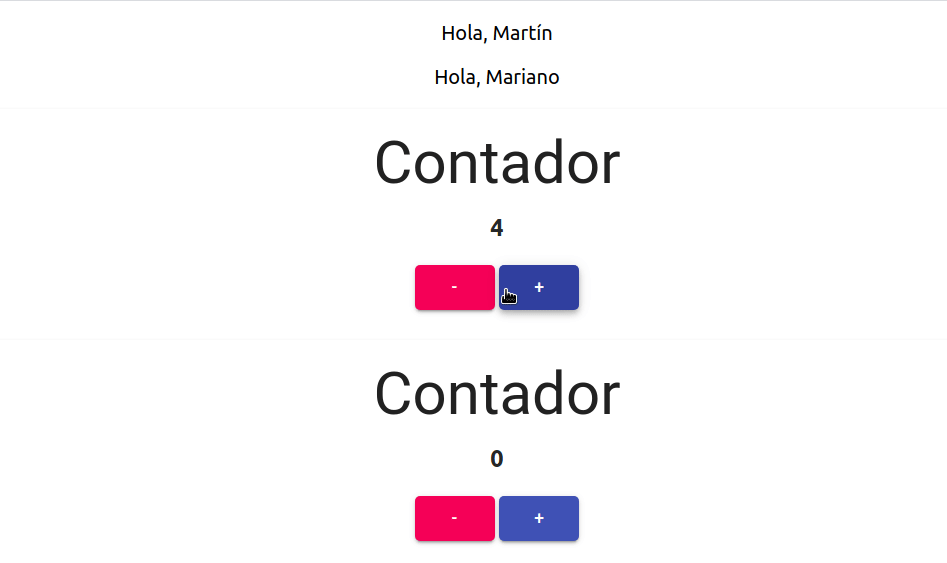

[](https://travis-ci.org/uqbar-project/eg-hola-mundo-react)

# Hola mundo: primer ejemplo React



En este primer ejemplo veremos los primeros conceptos de la tecnología React

- componentes
- propiedades (_props_)
- manejo del estado de un componente 

## Creando nuestro proyecto

Podés ver cómo hacerlo en [esta página](./yarn.md), lo que incluye también un mini-tutorial de `yarn`, la herramienta similar a `npm`.

## Componente principal

La aplicación levanta como una _lambda_, es decir una función que devuelve como output el HTML a mostrar (lo que debe renderizar):

```jsx
const App = () => {
  return (
    <div className="App">
      <Saludo nombre="Martín" />
      <Saludo nombre="Mariano" />
      <Contador />
      <Contador />
    </div>
  )
}
```

Recordemos que `const App = () => {}` es el formato en _arrow functions_ similar a

```jsx
function App() {
  return (
    ...
  )
}
```

Esta forma de definir un componente presentacional de React es la variante **funcional**, porque pensamos una página como una función. El código que escribimos es [**JSX**](https://reactjs.org/docs/introducing-jsx.html), **es javascript** con

- tags HTML
- más código javascript que se evalúa
- más los componentes React que nosotros definimos 
- más componentes React que importamos de bibliotecas de terceros 

## Componente que saluda

El componente que saluda recibe como parámetro un string, que corresponde al nombre de la persona que queremos saludar. El componente principal de React llama al que saluda mediante un atributo:

```jsx
<Saludo nombre="Martín" />
```

Saludo se define como otro componente funcional que sabe mostrar un div:

```javascript
const Saludo = (props) => {
  return (
    <p data-testid="saludo">
      Hola, {props.nombre}
    </p>
  )
}
```

Entonces, la vista es una función.

## Props

Aquí vemos que lo que enviamos con el siguiente formato

```jsx
 <Saludo nombre="Martín" />
```

lo recibimos como

```javascript
{props.nombre}
```

en el componente original. ¿Pero qué es [_props_](https://reactjs.org/docs/components-and-props.html)? 

> Props es un mapa de propiedades que cada componente mantiene en forma aislada. De esa manera podemos tener dos componentes que saludan y cada uno muestra diferente información en base al parámetro que enviamos.

## Contador

El contador es un componente que tiene cambios de estado. Comienza inicialmente en cero, pero luego el usuario puede

- hacer click en el botón que suma uno al contador
- o hacer click en el botón que resta uno al contador

## El estado

Mientras que las _props_ no modifican el estado del componente (son de lectura), el _state_ está íntimamente relacionado con el ciclo de vida de un componente React. Cuando un evento dispara un cambio, se genera un **nuevo estado** que provoca que se renderice nuevamente la vista.


En nuestro caso, el estado es simplemente un objeto que contiene un valor numérico:

```json
{ "contador": 0 }
```

Al iniciar el componente el contador será 0, y cuando el usuario presione click sobre el botón Sumar o Restar se debe generar un nuevo estado, con el contador incrementado o decrementado. Los componentes de React que almacenan estado debemos convertirlas en clases (no pueden ser funciones, al menos no en la variante _vainilla_: luego aprenderemos técnicas para mantener estado dentro de un componente con estilo funcional).

```jsx
export default class Contador extends Component {
  constructor(props) {
    super(props)
    this.state = {
      contador: 0
    }
  }

  sumar = () => {
    this.setState({ contador: this.state.contador + 1 })
  }

  restar = () => {
    this.setState({ contador: this.state.contador - 1 })
  }
```

Como resultado, la vista volverá a renderizarse:

```jsx
render() {
  return (
    <Card>
      <CardContent>
        ...
        <h3 data-testid="contadorValue">
          {this.state.contador}
        </h3>
        <Button
          variant="contained" data-testid="restar" size="medium" color="secondary"
          onClick={this.restar}>
          -
        </Button>
        <Button
          variant="contained" data-testid="sumar" size="medium" color="primary"
          onClick={this.sumar}>
          +
        </Button>
        <br />
      </CardContent>
    </Card>
  )
}
```

## Programación reactiva

Debido a que además el único elemento del tag asociado al state es el tag Typography que muestra un título H3 de HTML, React manipula en forma inteligente el [DOM](https://es.wikipedia.org/wiki/Document_Object_Model) para que la interacción con el browser sea mínima. Con F12 activamos las herramientas de desarrollo del navegador:


## Repaso del ciclo de vida del contador

1. Inicialmente, nuestro estado tiene un contador en cero. 
2. Se muestra la vista con el contador en cero.
3. El usuario presiona el botón "+"
4. Eso dispara el evento sumar(), que modifica el estado a { contador: 1 } mediante un setState()
5. Al cambiar el estado, React vuelve a ejecutar el método render() buscando los tags del DOM que se han modificado
6. El usuario ve en el navegador el valor "1" asociado al contador

## Cuidados a tener con el efecto

ReactJS trabaja con las ideas de la programación funcional, esto implica:

- nunca modificar directamente el valor de un objeto. En este caso un número en javascript es inmutable, al igual que un string. Pero **si tenemos un objeto propio, o una colección, no debemos modificarla directamente porque esto rompe el contrato de React**
- tampoco debemos actualizar el estado directamente

```javascript
this.state = { contador: 3 }      // INCORRECTO
this.setState( {contador : 3} )   // CORRECTO
```

Más adelante veremos otros ejemplos de uso.

# Frameworks de presentación

Para la presentación utilizamos [Material-UI](https://material-ui.com/), por si el lector quiere conocer.

# Testing

Para el testeo unitario utilizaremos JEST + [React Testing Library](https://testing-library.com/), un framework de testeo unitario que viene con varias funciones utilitarias y opciones de debugging que nos facilitarán la vida cuando los tests fallen. El primer test es que el componente App se renderiza sin romperse, lo que llamamos comunmente un _smoke test_ o test de humo que verifica por ejemplo que hay un saludo a Mariano:

```js
test('smoke test for App', () => {
  const { getByText } = render(<App />)
  const saludoAMariano = getByText(/Mariano/i)
  expect(saludoAMariano).toBeInTheDocument()
})
```

## Componente que saluda

El segundo test prueba en forma aislada que el componente que saluda lo hace en forma correcta:

```javascript
describe('cuando le paso un nombre', () => {
  it('lo muestra', () => {
    const { getByTestId } = render(<Saludo nombre='Manola' />)
    const appIntro = getByTestId('saludo')
    expect(appIntro).toHaveTextContent('Hola, Manola')
  })
})
```

- con `render` envolvemos el componente Saludo en un objeto _wrapper_ pasándole como nombre 'Manola'
- el _wrapper_ devuelve un objeto con varias funciones, una de las que nos interesa es buscar por `data-testid`
- luego chequeamos que el texto de ese tag sea 'Hola, Manola'

Algo bueno que tienen los tests de React es que conservan su unitariedad, se prueban en forma aislada.

## Contador

Por último vamos a testear el contador envolviendo el componente y luego simulando que apretamos 3 veces el botón "+":

```javascript
describe('cuando se suma', () => {
  it('el contador incrementa', () => {
    const { getByTestId } = render(<Contador />)
    const botonSumar = getByTestId('sumar')
    botonSumar.click()
    botonSumar.click()
    botonSumar.click()
    const valor = getByTestId('contadorValue')
    expect(valor).toHaveTextContent('3')
  })
})
```

Como resultado el componente debe mostrar en el tag h3 el valor '3' (estén atentos a que es un string). Para buscar elementos, lo hacemos a través del atributo `data-testid`.

Esta variante es la más reciente de React, si estás buscando una versión anterior, podés consultar el branch [clase-2019](https://github.com/uqbar-project/eg-hola-mundo-react/tree/clase-2019).
