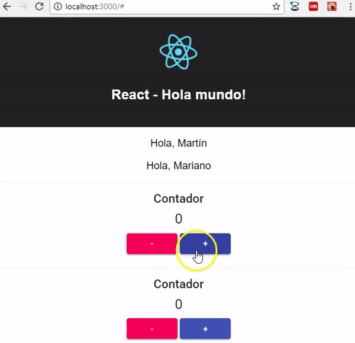
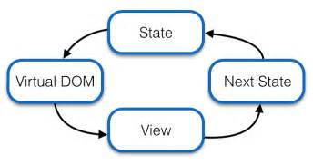
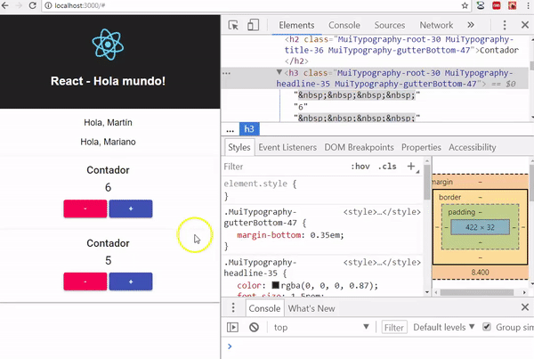

# Hola mundo: primer ejemplo React

[](https://travis-ci.org/uqbar-project/eg-hola-mundo-react)



En este primer ejemplo veremos los primeros conceptos de la tecnología React

- componentes
- propiedades (_props_)
- manejo del estado de un componente 

Como es nuestro primer ejemplo, estaremos definiendo dos componentes en el archivo _App.js_. A futuro estaremos dividiendo la aplicación en diferentes archivos.

# Componente que saluda

El componente que saluda recibe como parámetro un string, que corresponde al nombre de la persona que queremos saludar. El componente principal de React llama al que saluda mediante su tag correspondiente:

```javascript
class App extends Component {

  render() {
    return (
      <div className="App">
        <header className="App-header">
          
          <h1 className="App-title">React - Hola mundo!</h1>
        </header>
        <Saludo nombre="Martín" />
        <Saludo nombre="Mariano" />
```

¿Dónde lo hace? En el método render() que trabaja con [**JSX**](https://reactjs.org/docs/introducing-jsx.html), que no es HTML, sino javascript que trabaja con

- tags HTML 
- más los componentes React que nosotros definimos 
- más componentes React que importamos de bibliotecas de terceros 
- más código javascript que se evalúa para renderizarse en el contenido a mostrar, por ejemplo con la variable logo 

Saludo se define como una clase que extiende Component y que sabe mostrar un div:

```javascript
class Saludo extends Component {
  render() {
    return (
      <p className="App-intro">
        Hola, {this.props.nombre}
      </p>
    )
  }
}
```

## Props

Aquí vemos que lo que enviamos con el siguiente formato

```html
 <Saludo nombre="Martín" />
```

lo recibimos como 

```javascript
{this.props.nombre}
```

en el componente original. ¿Pero qué es [_props_](https://reactjs.org/docs/components-and-props.html)? Un mapa de propiedades que cada componente mantiene en forma aislada. De esa manera podemos tener dos componentes que saludan y cada uno muestra diferente información en base al parámetro que enviamos.

# Contador

El contador es un componente que tiene cambios de estado. Comienza inicialmente en cero, pero luego el usuario puede 

- hacer click en el botón que suma uno al contador
- o hacer click en el botón que resta uno al contador

## El estado

Mientras que las _props_ no modifican el estado del componente (son de lectura), el _state_ está íntimamente relacionado con el ciclo de vida de un componente React. Cuando un evento dispara un cambio, se genera un **nuevo estado** que provoca que se renderice nuevamente la vista.



En nuestro caso, el estado es simplemente un objeto que contiene un valor numérico:

```json
{ "contador": 0 }
```

Al iniciar el componente el contador será 0, y cuando el usuario presione click sobre el botón Sumar o Restar se debe generar un nuevo estado, con el contador incrementado o decrementado:

```javascript
class Contador extends Component {
  constructor(props) {
    super(props)
    this.state = { contador: 0 }
  }

  sumar() {
    this.cambiarContador(this.state.contador + 1)
  }

  restar() {
    this.cambiarContador(this.state.contador - 1)
  }

  cambiarContador(n) {
    this.setState({ contador: n })
  }
```

Como resultado, la vista volverá a renderizarse:

```javascript
  render() {
    return (
      <Card>
        <CardContent>
          <Typography gutterBottom variant="title" component="h2">
            Contador
          </Typography>
          <h3 id="contadorValue">
            {this.state.contador}
          </h3>
          <Button variant="contained" id="restar" size="medium" color="secondary" onClick={(event) => { this.restar() }}>-</Button>
          &nbsp;
          <Button variant="contained" id="sumar" size="medium" color="primary" onClick={(event) => { this.sumar() }}>+</Button>
          <br />
        </CardContent>
      </Card>        
    )
  }
```

## Programación reactiva

Como además el único elemento del tag asociado al state es el tag Typography que muestra un título H3 de HTML, React manipula en forma inteligente el [DOM](https://es.wikipedia.org/wiki/Document_Object_Model) para que la interacción con el browser sea mínima. Con F12 activamos las herramientas de desarrollo del navegador:



## Repaso del ciclo de vida del contador

1. Inicialmente, nuestro estado tiene un contador en cero. 
2. Se muestra la vista con el contador en cero.
3. El usuario presiona el botón "+"
4. Eso dispara el evento sumar(), que modifica el estado a { contador: 1 } mediante un setState()
5. Al cambiar el estado, React vuelve a ejecutar el método render() buscando los tags del DOM que se han modificado
6. El usuario ve en el navegador el valor "1" asociado al contador

## Cuidados a tener con el efecto

ReactJS trabaja con las ideas de la programación funcional, esto implica:

- nunca modificar directamente el valor de un objeto. En este caso un número en javascript es inmutable, al igual que un string. Pero **si tenemos un objeto propio, o una colección, no debemos modificarla directamente porque esto rompe el contrato de React**
- tampoco debemos actualizar el estado directamente 

```javascript
this.state = { contador: 3 }      // INCORRECTO
this.setState( {contador : 3} )   // CORRECTO
```

Más adelante veremos otros ejemplos de uso.

# Frameworks de presentación

Para la presentación utilizamos [Material-UI](https://material-ui.com/), por si el lector quiere conocer.

# Testing

Para el testeo unitario utilizaremos [Enzyme](https://github.com/airbnb/enzyme), un framework de testeo realizado por el equipo de desarrollo de Airbnb. El primer test es que el componente App se renderiza sin romperse, es el que generó create-react-app pero adaptado a los mocks de Enzyme:

```javascript
it('app levanta ok', () => {
  shallow(<App />)
})
```

_shallow_ es una función que decora nuestro componente para no levantar ningún navegador. Esto lo hacemos en el archivo App.test.js del directorio src.

## Componente que saluda

El segundo test prueba en forma aislada que el componente que saluda lo hace en forma correcta:

```javascript
it('si saludo a Manola me dice Hola Manola', () => {
  const wrapper = shallow(<Saludo nombre='Manola' />)
  const p = wrapper.find('.App-intro')
  expect(p.text()).toBe("Hola, Manola")
})
```

- envolvemos el componente Saludo en un objeto _wrapper_ pasándole como nombre 'Manola'
- el _wrapper_ de Enzyme permite que busquemos por clase, id o por un tag específico. En este caso buscamos un elemento HTML que tenga como clase App-intro
- luego chequeamos que el texto de ese tag sea 'Hola, Manola'

Algo bueno que tienen los tests de React es que conservan su unitariedad, se prueban en forma aislada.

## Contador

Por último vamos a testear el contador envolviendo el componente y luego simulando que apretamos 3 veces el botón "+":

```javascript
it('sumar - contador de 0 a 3', () => {
  const wrapper = shallow(<Contador/>)
  const btnSumar = wrapper.find('#sumar')
  btnSumar.simulate('click')
  btnSumar.simulate('click')
  btnSumar.simulate('click')
  const contador = wrapper.find('#contadorValue')
  expect(contador.text()).toBe('3')
})
```

Como resultado el componente debe mostrar en el tag h3 el valor '3' (estén atentos a que es un string).
